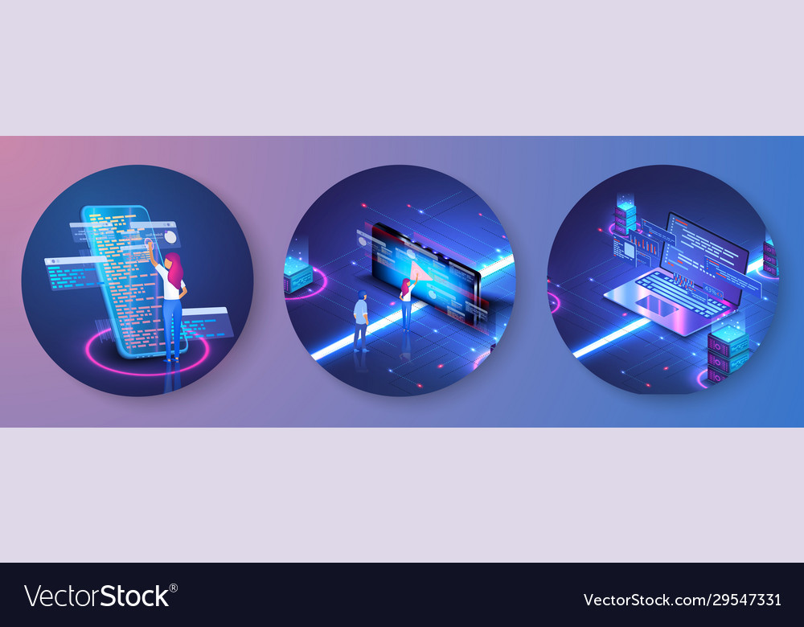

<h1 align="center">Hi 👋, I'm SHIVAM SISODIA</h1>
<h3 align="center">I am a passionate programmer from india.I am an electronics and communication undergraduate at Delhi technological university.</h3>

  

  

  

- 🔭 I’m currently working on **a e-commerce site**

- 🌱 I’m currently learning **Backend Web Development and Api**

- 👨‍💻 All of my projects are available at [https://github.com/shivamsisodia07](https://github.com/shivamsisodia07)

- 📫 How to reach me **shivamsisodia8656816@gmail.com**

- ⚡ Fun fact **Hot water will turn into ice faster than cold water.**

<h3 align="left">Connect with me:</h3>

<h3 align="left">Languages and Tools:</h3>

            

&nbsp;

